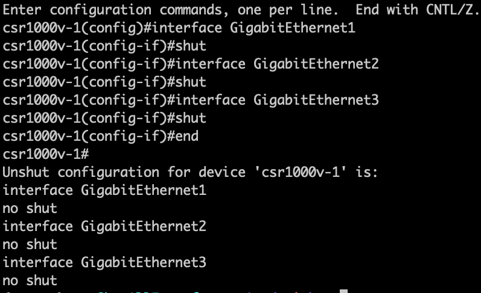

# ShutAllInterfaces

Shut all the interfaces of a provided device


 
## Use Case Description

> How can I shut all the interfaces on a specific device.

At Cisco Live, an attendee asked me this very question. He had to shut multiple devices, but wanted to make sure it would not affect his production network. However, he did not want to waste his time shutting hundred to thousand of interfaces manually.

We sat together, and coded this small but very useful script.

This becomes very important when wanting to decomission a device. It allows to make sure the network is performing as expecting without this device operational. However, it can be brought back in a few seconds if needed.

The "Un shut" configuration is also provided at the end of the run, to quickly revert if needed.


Other ideas to enhance this script could be:

* Take operation snapshot of the surounding device, to make sure nothing important has been lost. This would automatically let the user know of what has changed.
* Connect to each device in parallel
* Do the shut for each device in parallel
* Modify if os is iosxe to use device.api - which are abstracted

## Installation

This script requires pyATS. Follow this [guide](https://developer.cisco.com/docs/pyats-getting-started/) on how to install it and get started with it.

Then you will need a Testbed file. Follow this [guide](https://pubhub.devnetcloud.com/media/pyats-getting-started/docs/quickstart/manageconnections.html#) on how to create one.

A testbed file is a way to represent your device. It contains the device name, credentials and ip address on how to reach it.

## Usage

To execute it, just do the following:

```bash
# Shut all interfaces of csr1000v-1
python shutinterfaces.py --testbed-file testbed.yaml  --devices csr1000v-1

# Shut all interfaces of csr1000v-1 and nx-osv-1
python shutinterfaces.py --testbed-file testbed.yaml  --devices csr1000v-1 nx-osv-1

# Shut all interfaces of csr1000v-1 Except Loopback0 and Loopback1
python shutinterfaces.py --testbed-file ../../training/genie-bootcamp/tb.yaml  --devices csr1000v-1 --exclude csr1000v-1:Loopback0,Loopback1
```

Where `testbed.yaml` represents your testbed file.

This script should work on all Cisco main OS (XR, IOSXE, NXOS and IOS).

## Getting help

If you have questions, concerns, bug reports, etc., please create an issue against this repository.

## Author(s)

This project was written and is maintained by the following individuals:

* Jean-Benoit Aubin <jeaubin@cisco.com>
* pyats-support@cisco.com
